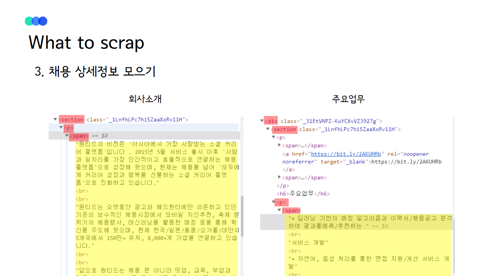

## Wanted Job:heart: 
### 원티드 개발 직군 채용공고 웹스크래핑


#### 언어 
* Python 3.6 v
* DB 서버 환경 Ubuntu

#### 사용 라이브러리 및 리소스
* requests
* selenium
* beautifulsoup
* multiprocessing
* itertools
* re
* json
* time, csv

* chromedriver


#### DB 환경 
* MongoDB
* pymongo 라이브러리 이용

 * 서버에 MongoDB 세팅
 * MongoDB 포트 변경


#### 설명

1. 개발 직군에 속한 모든 카테고리의 'href' save 

`https://www.wanted.co.kr/wdlist/518?country=kr&job_sort=job.latest_order&years=-1&locations=all`

* 채용 직군 : '개발', wdlist/518
* 채용 국가 : '한국', country=kr
* 필터링 job_sort
    1) 최신순 : job.latest_order
    2) 경력무관(모두) : years=-1
    3) 전국 : locations=all
    
2. 카테고리별 모든 채용공고의 'href' save 
3번에서 발생한 오류를 잡기 위해 1번으로 다시 돌아가는 것은 비효율적이라고 생각하여 해당 항목의 정보는 csv 파일에 저장해두었다.

3. 채용상세정보 크롤링
채용상세정보는 MongoDB object insert를 고려하여 json 형태로 RecruitInfo.json에 저장된다. 추후 해당정보는 mongo DB의 RecruitInfo 컬렉션에 저장될 예정이다.

###### 채용상세정보 기본 항목
```'id', '직군', '지역', '국가', '태그', '회사명', '회사소개', '주요업무', '자격요건', '우대사항', '혜택 및 복지', '마감일', '근무지'```

#### 정리 자료





#### 회고

1. 원티드는 동적 웹으로, 화면 크기에 따라 태그 구조가 바뀌는 부분이 있다. 이로 인해 사전에 분석한 태그 구조를 기반으로 selenium selector로 element를 찾았지만, selector가 해당 element를 찾지 못했다. select를 잘못한 것인지, iframe이 있어서 찾지를 못하는 건지 등 여러 가지를 시도해보았다. web driver에 화면 크기를 고정하는 option을 주어 해결할 수 있었다.

2. 채용상세정보에서 기본적으로 직군, 회사명, 회사소개, 주요업무, 자격요건, 우대사항, 혜택 및 복지, 모집일, 근무지를 알 수 있다. 하지만 어떤 채용상세정보에서 기본 항목에 대응되는 값이 없었다. try/expect로 에러를 ErrorHistory.json에 기록하고 해당 항목에는 None 값을 할당했다.

